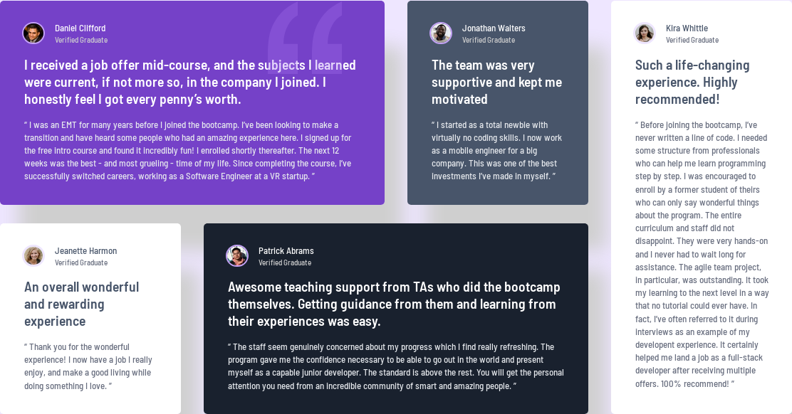

# Frontend Mentor - Testimonials grid section solution

This is a solution to the [Testimonials grid section challenge on Frontend Mentor](https://www.frontendmentor.io/challenges/testimonials-grid-section-Nnw6J7Un7). Frontend Mentor challenges help you improve your coding skills by building realistic projects.

## Table of contents

- [Overview](#overview)
  - [The challenge](#the-challenge)
  - [Screenshot](#screenshot)
  - [Links](#links)
- [Built with](#built-with)
- [Author](#author)

## Overview

### The challenge

Users should be able to:

- View the optimal layout for the site depending on their device's screen size

### Screenshot

### Links

- Solution URL: [https://github.com/mickael-o3o/testimonials-grid-section.git](https://github.com/mickael-o3o/testimonials-grid-section.git)
- Live Site URL: [https://mickael-o3o.github.io/testimonials-grid-section](https://mickael-o3o.github.io/testimonials-grid-section)

## Built with

- [Vue](https://vuejs.org)
- [Sass](https://sass-lang.com)
- Mobile-first workflow
- CSS custom properties
- Flexbox
- CSS Grid
- Mobile-first workflow

## Author

- Frontend Mentor - [@mickael-o3o](https://www.frontendmentor.io/profile/mickael-o3o)
